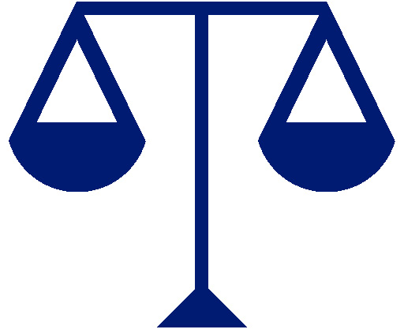

Ethics is the set of rules and standards that people adhere to as a moral obligation to the way we live in today's world. 
When ethics are not followed, disaster often occurs which not only includes large monetary costs and 
environmental repercussions, but may also result in the loss of human life. Ethics in the context of software engineering 
is then defined as a set of fundamental ethical principles that we as software engineers must understand and then make a 
decision of whether or not the choice we make have a positive impact to society and the world.

In the case study involving Facebook, million of personal data from people's Facebook profiles were being collected without
their consent is an evident instance of violating the rights to individual privacy.  From a software engineering standpoint,
we are obliged to assess the moral and ethical implications of the software that we develop.  Additionally, we need to consider
how the software we create can be used irresponsibly and the compromises that should be made if ethical dilemmas do arise.

With all facts considered, if we as software engineers understand the impact of the software we create from a holistic 
standpoint.  As software engineers we need to accept that although the work we do will have both positive and negative 
consequences, we should place the interest of the public in the highest priority.  The constantly changing nature of 
technology makes it difficult to assign a set of specific moral codes that will solve a specific issue, rather we need to 
consider the fundamental ethic principles and apply it to serve a basis for ethical decision-making.
