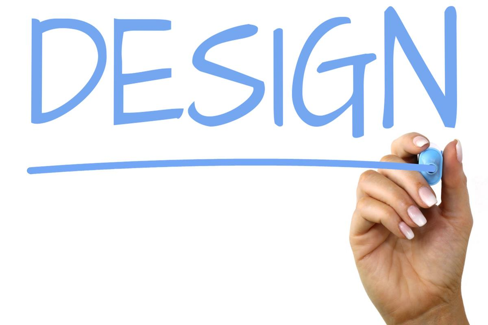

When I started my first programming job I had the opportunity to work on a web-application project that would be used by
students at University Laboratory School to manage thermal comfort levels.  With zero previous experience with web development,
I was overwhelmed during my first couple of weeks as I tried to cram everything I could possibly learn about the different 
frameworks and libraries that the project were using.  Finally confident enough with my own skills, I asked my mentor Allie to 
give me a task to do so that I prove my technical know how.

My first assignment was simple: enlarge the size of Bootstrap select field so that students are able to view all possible choices
at once instead of needing to scroll through.  Easy fix I thought to which after doing a quick search on Google I copied the 
top-rated comment from StackOverflow with a similar issue which was to override the default CSS style.  I did this by adding
a new CSS file in some random folder location which at the time I thought would not be an issue.  Regardless, following the 
StackOverflow comment solved my issue.  I went on to submit my first pull request to the issue and thought I had it in the bag.
Wrong.  Within 10 minutes of submission I noticed that the pull request has been updated and changes were requested.  "Please
see me" was written in the comments.  I was confused with what could've been the problem to which I thought was because of the
name of the CSS file created.

"Do you know what MVC is?" was the first thing she asked.  Puzzled, I asked for an explanation for it 
