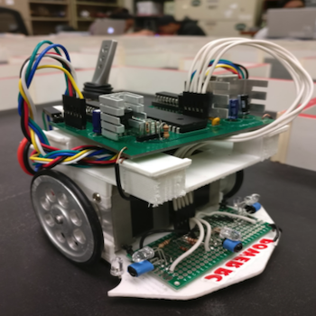
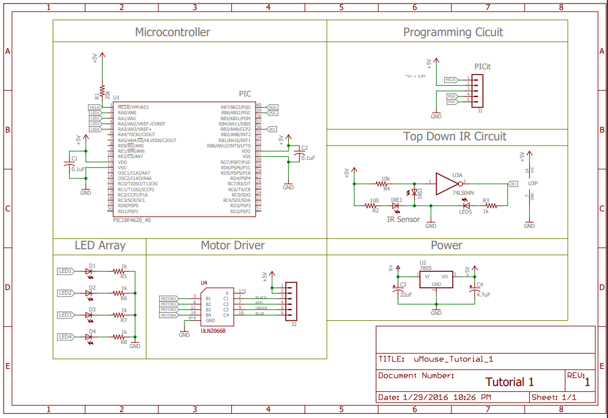
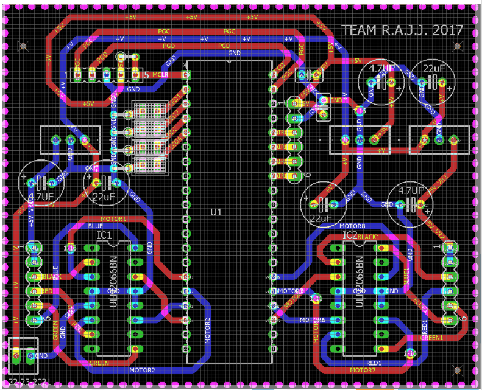

A micromouse is a small robotic vehicle designed to navigate its way through an unknown maze. It is an autonomous, battery-operated, and self-contained robot that utilizes maze-solving algorithms to find the optimal route with the shortest run time to the center of the maze. The main challenge is to equip the electro-mechanical device with adaptive intelligence which enables the exploration of different maze configurations.  By combining these components, an autonomous mouse capable of navigating through a maze was designed, built, and programmed.

  
  
  

## Responsibilites
For this project, I was responsible with the hardware portion of the project.  For this project, all the necessary hardware components such as IC chips, sensors, and motors were given to us.  Then the hardware portion of this project mainly consisted of figuring how to connect all these parts and then testing that the components work.  In particular, I was in charge of designing the PCB and helped in populating the board with the various electronical components.  Additionally, I helped in debugging and testing the PCB to ensure that the all the hardware components were working as intended.

## Learning Outcome
Due to the self-directiveness of this project, I was able to learn both technical and design skills.  On the technical side, I gained experience working with a PIC microcontroller and using EAGLE software to draft PCB schematic.  In terms of design skills, I learned how to breakdown tasks into manageable sections along and how to work between teams as this project was divided by its hardware and software subsystems.

## Test Run

