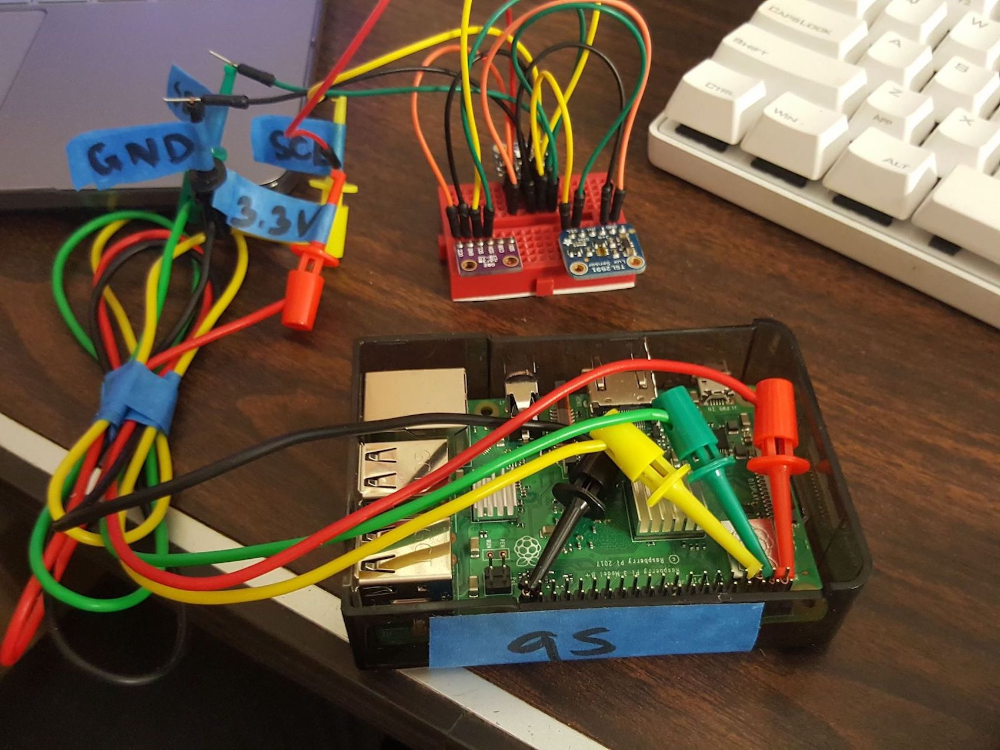

Currently, the use of [commercial data loggers](https://www.onsetcomp.com/products/data-loggers?creative=294992075747&keyword=%2Bonset%20%2Bhobo&matchtype=b&network=g&device=c&gclid=CjwKCAiAyfvhBRBsEiwAe2t_i-nSpQpSnHPNjdbXnWrRREDUyKLRAIy3FyBOUWZjbRd4cNSfuYOVlhoCYs8QAvD_BwE) add a significant cost burden to energy monitoring projects as often several units are necessary to cover a large area of interest.  The objective of this project was to design and develop a low-cost, accurate, and reliable data logger that can easily be reproduced to be used for the School of Architecture Environmental Design and Research Laboratory at UH Manoa.  By collecting luminance, temperature, and relative humidity data, these data loggers serve as a reliable source of datasets to be used by the School of Architecture and its partner Hawaii Natural Energy Institute for future projects.  The data collected monitors the indoor conditions at project sites which will assist in evaluating the performance of these energy-efficient building design.  By providing valuable data measurements, researchers are able to analyze the given datasets and then make informed decisions on how to improve building design.

## Responsibilites
The data logger was built using an [Raspberry Pi 3](https://www.raspberrypi.org/products/raspberry-pi-3-model-b/), [Si7021 Temperature and Humidity Sensor](https://www.adafruit.com/product/3251), and [TSL2561 Luminosity Sensor](https://www.adafruit.com/product/439).  Firmware was developed for the Raspberry Pi to consistently record data and upload to a remote database.  Additionally bash scripts were written for quality assurance including routinely reboot, track data logger uptime, and ensure logging scripts to be running.  Once the preliminary features were implemented and the data logger was built, the datalogger was deployed inside the office over the course of a month, monitoring it for temperature and general processes.  

## Learning Outcome
As the individual contributor to this project, I was responsible for all aspect of the project.  This included starting from deciding what parts to use (microcontroller, sensors) to programming, testing, and finally deploying the unit.  I gain additional experience working with Raspberry Pi, Python programming, and writing Bash scripts.  From this, I became a lot more comfortable working in a Linux-based environment and working through the command-line interface.

Source: <a href="https://github.com/erdl/sensors" target="_blank"><i class="large github icon"></i>https://github.com/erdl/sensors</a> 
