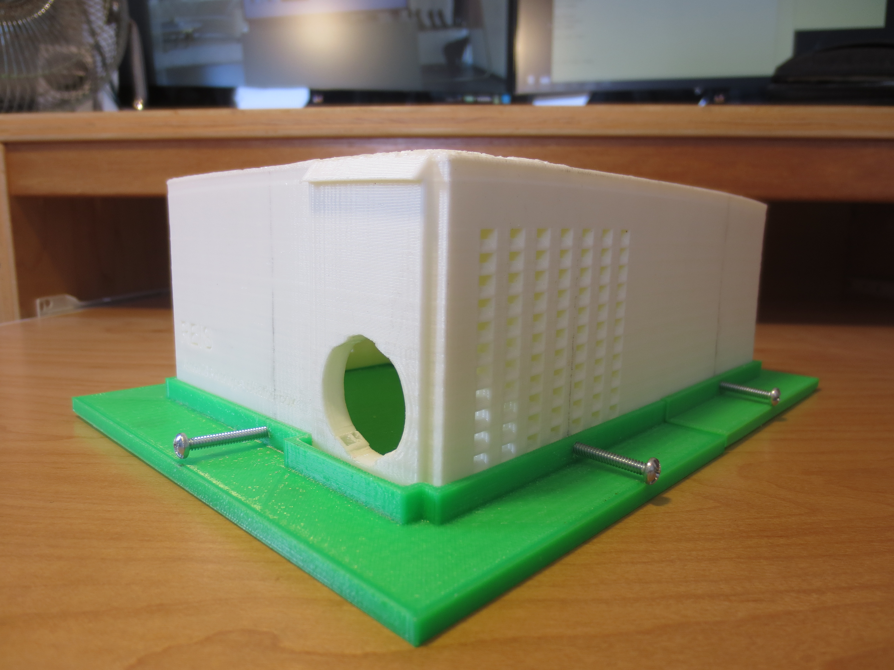

Currently, the use of [commercial data loggers](https://www.onsetcomp.com/products/data-loggers?creative=294992075747&keyword=%2Bonset%20%2Bhobo&matchtype=b&network=g&device=c&gclid=CjwKCAiAyfvhBRBsEiwAe2t_i-nSpQpSnHPNjdbXnWrRREDUyKLRAIy3FyBOUWZjbRd4cNSfuYOVlhoCYs8QAvD_BwE) add a significant cost burden to energy monitoring projects as often several units are necessary to cover a large area of interest.  The objective of this project was to design and develop a low-cost, accurate, and reliable data logger that can easily be reproduced to be used for the School of Architecture Environmental Design and Research Laboratory at UH Manoa.

By collecting luminance, temperature, and relative humidity data, these data loggers serve as a reliable source of datasets to be used by the School of Architecture and its partner Hawaii Natural Energy Institute for future projects.  The data collected monitors the indoor conditions at project sites which will assist in evaluating the performance of these energy-efficient building design.  By providing valuable data measurements, researchers are able to analyze the given datasets and then make informed decisions on how to improve building design.

As the individual contributor to this project, I was responsible for all aspect of the project.  This included starting from deciding what parts (microcontroller, sensors) we should buy to programming, testing, and finally deploying the unit.  
In terms of design skills, since this project was built completely from scratch, I learned how to implement features in small increments and learned how to effectively break down tasks into manageable sections.

Picture of data logger housing (without electronics)

  

