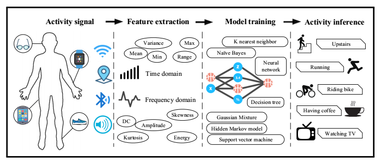

  

The goal of the project was to build a recognition system using deep learning that would be able to identify the type of movement (walking, running, jogging, sitting, walking-up stairs, walking-down stairs) that an individual was doing in real-time.  This project was done as part of my exchange program at Tokyo University of Agriculture and Technology in Summer 2018.  During my stay, I had the opportunity to work under Professor Tanaka in his laboratory along with other international students on this project.

I was responsible for develop a front-end interface for this recognition system.  I developed an android application that integrated the pre-trained TensorFlow model and display the predicted activity.  Additionally, I worked on developing processing techniques that would reduce noise from real-time accelerometer and gyroscope data of the smartphone.  I ended up implementing a low-pass filter that was able to stabilize the noisy accelerometer signal

In this project, In this project, I gained experience using Android SDK for development and TensorFlow in implementing and training a CNN model.  Additionally, I was able to learn firsthand about deep learning, neural networks, and how these technologies are being used in research projects as the laboratory I was working on focused on machine learning.
