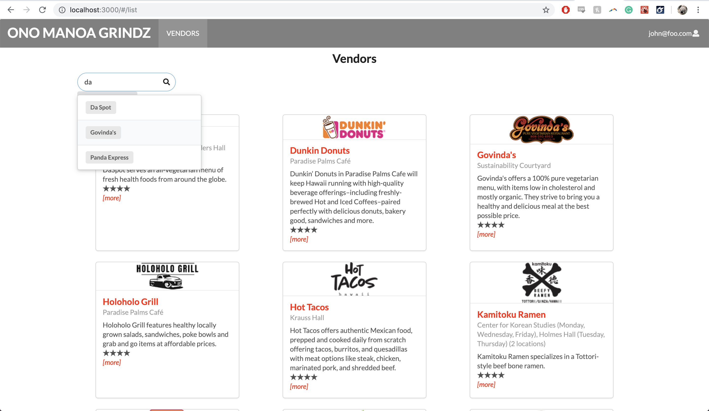
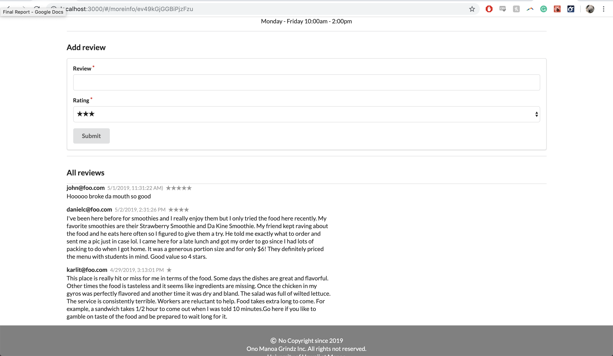

## Overview
Ono Manoa Grindz serves as the homepage for showcasing the vast variety of cuisines that is served here on the University 
of Hawaii at Manoa campus. With a quick visit to our page, you will be able to view information for each food service 
vendors along with user-submitted ratings that we hope will serve useful.

## Contributions
My contribution for this project included creating the add vendor form page which allows admin to add a new vendor to the 
collection.  Another component that I worked on was creating default collections to the database and designed what each 
collections should have and how it will work together.  Finally I implemented the search bar that allows users to search for
a specific food vendor and worked on rendering the reviews associated with a vendor.

## Learning Outcome
In this project, I gained project experience by working as a team of 4 to build this web application.  By practicing issue
driven project management, we were able to work independently while progressing in the project.  Some of the technical skills
that we learned in this project was using JavaScript, Semantic UI, React, and Meteor to build the web application and used
Galaxy for deployment.

## Screenshots

[Organization Github Page](https://ono-manoa-grindz.github.io/)
